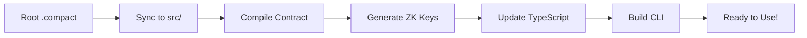

# 🌙 Midnight Compact Contract CLI Generator

**The fastest way to develop Midnight contracts.** Write your `.compact` contract anInteractive CLI will start:
```
✅ Auto-detected contract from source: counter (from counter.compact)
📊 Available functions: increment, get_count

You can do one of the following:
  1. Deploy a new Counter Contract
  2. Join an existing Counter Contract
  3. Exit
Which would you like to do?
```

## 💡 Development Tips

### **Best Practices**
- 🔄 **Always run `npm run dev`** after any contract changes
- 📝 **Use descriptive function names** - they become CLI commands
- 🧪 **Test functions locally** before deploying to testnet
- 📊 **Check CLI output** for function parameter hints and validation

### **Debugging**
- 🔍 **Contract not detected?** Make sure your `.compact` file is in the project root
- ⚠️ **Compilation errors?** Check that your contract has proper `pragma language_version` directive
- 🚫 **CLI generation failed?** Ensure all `export circuit` functions have valid syntax
- 🌐 **Testnet issues?** Verify your wallet has sufficient balance for transactions

### **Development Workflow**
```bash
# 1. Edit your contract
vim my-contract.compact

# 2. Deploy to testnet (automated)
npm run deploy

# OR: Interactive mode with prompts
npm run wallet

# 3. Iterate and improve
```

## 🎛️ Available Commandset:
- 🚀 Auto-generated CLI with all your functions
- 🌐 One-command testnet deployment  
- 🔄 Dynamic updates when you change your contract
- 📦 Complete development environment

**No setup required.** No manual updates. Just pure contract development.

[](https://midnight.network)
[](https://typescriptlang.org)
[](LICENSE)

A powerful automated CLI generation system for writing, testing, and deploying **Midnight Compact contracts**. This project provides a complete development workflow that automatically adapts to your contract changes without requiring any manual code updates. The developer has to write just the contract the rest will be handled by the cli

All you need to start your new project is 
   ```bash

git clone https://github.com/kaleababayneh/scaffold-midnight.git
cd scaffold-midnight
touch my-contract.compact
npm install
npm run deploy  # One command for complete local deployment!
 ```

Or for testnet deployment:
```bash
npm run wallet
```

## 🚀 Features

### ✨ **Automated CLI Generation**
- **Source-Driven**: Automatically detects and analyzes your `.compact` contract files
- **Dynamic Function Discovery**: Finds all contract functions and generates CLI commands
- **Zero Manual Updates**: Change function names → run auto-generator → everything updates automatically
- **Smart Contract Detection**: Works with any contract name and any number of functions
- **Witness Function Support**: Automatically detects and includes witness functions in API/CLI

### 🚀 **One-Command Deployment**
- **Local Development**: `npm run deploy` for complete local deployment workflow
- **Docker Integration**: Automatically starts local Midnight node via Docker containers
- **Prerequisites Check**: Validates Docker, contracts, and dependencies before deployment
- **Interactive CLI**: Launches ready-to-use CLI for contract interaction
- **Dry Run Support**: `npm run deploy --dry-run` to preview commands without execution

### 🔧 **Developer-Friendly Workflow**
- **Root-Level Editing**: Edit contracts in the project root for easy access
- **Auto-Sync**: Automatically copies root contracts to the correct build directories
- **Clean Builds**: Removes old contract files before copying new ones
- **Comprehensive Compilation**: Handles ZK key generation and TypeScript building

### 🌐 **Testnet Integration**
- **One-Command Deployment**: Deploy contracts to Midnight testnet with `npm run wallet`
- **Interactive CLI**: User-friendly interface for calling contract functions
- **Wallet Management**: Built-in wallet creation and balance management
- **Transaction Support**: Full transaction lifecycle management

## 📁 Project Structure

```
example-counter/
├── counter.compact              # 📝 Edit your contract here (root level)
├── package.json                 # 📦 Main project configuration
├── boilerplate/
│   ├── contract/               # 🔨 Contract compilation
│   │   └── src/               # 📄 Auto-synced contracts
│   ├── contract-cli/          # 🖥️ Generated CLI application
│   │   └── src/              # 🎯 Dynamic CLI code
│   └── scripts/              # ⚙️ Auto-generation scripts
└── README.md                   # 📖 This file
```

## 🎯 Quick Start

### Prerequisites
- Node.js 18+
- npm or yarn
- Midnight Compact compiler (`compactc`)

### Installation

1. **Clone and Install**
   ```bash
   git clone <your-repo>
   touch my-contract.compact
   npm install
   ```

2. **Write Your Contract**
   
   Edit the `.compact` file in the project root:
   ```compact
   pragma language_version 0.15;
   
   import CompactStandardLibrary;
   
   export ledger counter: Counter;
   
   export circuit increment(value: Uint<16>): [] {
     counter.increment(value);
   }
   
   export circuit get_count(): Uint<64> {
     return counter;
   }
   ```

3. **Generate CLI**
   ```bash
   npm run dev
   ```

4. **Deploy to Local Network**
   ```bash
   npm run deploy
   ```

   Or test on testnet:
   ```bash
   npm run wallet
   ```

## 🔄 Development Workflow

### 1. **Edit Contract** (Root Level)
```bash
# Edit your contract file in the project root
nano counter.compact  # or use any editor
```

### 2. **Auto-Generate Everything**
```bash
npm run dev
```

This single command:
- 🔄 Syncs your root contract to `boilerplate/contract/src/`
- 🔨 Compiles the contract and generates ZK keys
- 📝 Updates TypeScript types and API functions
- 🖥️ Rebuilds the CLI with new contract functions
- ✅ Everything is ready to use!

### 3. **Deploy & Test**
```bash
npm run wallet
```

Interactive CLI will start:
```
✅ Auto-detected contract from source: counter (from counter.compact)
📊 Available functions: increment, get_count

You can do one of the following:
  1. Deploy a new Your Contract
  2. Join an existing yOUR Contract
  3. Exit
Which would you like to do?
```

## 🎛️ Available Commands

| Command | Description |
|---------|-------------|
| `npm run dev` | 🔄 Regenerate CLI from contract |
| `npm run generate-key` | 🔐 Generate new wallet seed and update .env |
| `npm run request-faucet` | 🚰 Request testnet tokens (shows manual steps due to captcha) |
| `npm run deploy` | 🌐 Deploy new contract to testnet (automated) |
| `npm run deploy:new` | 🌐 Deploy new contract to testnet (same as above) |
| `npm run deploy:join` | 🔗 Join existing contract on testnet (automated) |
| `npm run wallet` | 🌐 Launch testnet CLI (interactive) |
| `npm run build` | 🔨 Build all workspaces |
| `npm run test` | 🧪 Run all tests |

### 🚀 **Automated Testnet Deployment**

The `npm run deploy` command provides a complete deployment workflow to Midnight testnet:

```bash
npm run deploy
```

This will:
1. 🔨 **Compile** your `.compact` contract and generate CLI
2. 🌐 **Connect** to Midnight testnet
3. 📦 **Deploy** your contract automatically  
4. 🎯 **Launch** interactive CLI for testing

**Requirements:**
- Node.js 18+
- `.compact` contract file in project root
- Wallet with testnet funds (or will be funded automatically)

**Deployment Modes:**
```bash
# Deploy a new contract automatically (default)
npm run deploy

# Join an existing contract automatically  
npm run deploy:join

# Interactive mode (prompts for choices)
npm run wallet

# Preview what commands will be executed
npm run deploy -- --dry-run
```


## 🏗️ How It Works

### **Auto-Detection System**
The system automatically:

1. **Scans** the root directory for `.compact` files
2. **Copies** them to the contract source directory (replacing old ones)
3. **Analyzes** contract functions and ledger state
4. **Generates** TypeScript types and API functions
5. **Builds** a dynamic CLI that adapts to your contract

### **Function Discovery**
```javascript
// Automatically detected from your contract:
export circuit increment(value: Uint<16>): [] { ... }
export circuit get_count(): Uint<64> { ... }

// Becomes CLI options:
// 1. Increment (1 param)
// 2. Get Count (read-only)
```

### **Smart CLI Generation**
- **Parameter Detection**: Automatically detects function parameters
- **Type Safety**: Generates TypeScript interfaces
- **Read-Only Functions**: Identifies and marks query functions
- **Interactive Menus**: Creates numbered options for all functions

## 🔧 Advanced Configuration

### **Custom Contract Names**
Just rename your `.compact` file - everything adapts automatically:
```bash
mv counter.compact voting.compact
npm run auto-generate  # CLI now shows "Voting Contract"
```

### **Multiple Functions**
Add any number of functions to your contract:
```compact
export circuit vote_for(candidate: Uint<8>): [] { ... }
export circuit get_votes(candidate: Uint<8>): Uint<64> { ... }
export circuit reset_votes(): [] { ... }
```

The CLI automatically generates options for all functions.

## 🌐 Testnet Deployment

### **Wallet Setup**
The CLI handles wallet creation automatically. For automated deployment, you can set your wallet seed in the environment:

**Option 1: Auto-generate wallet seed and address (Quickest)**
```bash
# Generate a new wallet seed and address automatically
npm run generate-key

# Request testnet tokens (provides manual instructions due to captcha requirement)
npm run request-faucet

# Deploy automatically without prompts  
npm run deploy
```

**Option 2: Manual environment setup**
```bash
# Copy the example file
cp .env.example .env

# Edit .env and add your seed phrase
WALLET_SEED=your-64-character-hex-seed-phrase-here

# Deploy automatically without prompts
npm run deploy
```

**Option 3: Interactive mode**
```
npm run wallet
# Will prompt: Enter your wallet seed: [generates new seed if empty]
Your wallet address is: mn_shield-addr_test1...
Your wallet balance is: 966962817
```

When `WALLET_SEED` is set in your environment, deployment will be fully automated without prompting for the seed phrase.

📋 **See [ENV_CONFIGURATION_GUIDE.md](./ENV_CONFIGURATION_GUIDE.md) for detailed environment variable setup.**

### **Requesting Testnet Tokens**

After generating your wallet, you'll need testnet tokens for deployment. Use the faucet request command:

```bash
npm run request-faucet
```

**How it works:**
1. 🔗 Connects to funded genesis wallet (3.2B+ tokens available)
2. 🔧 Creates proper transfer transaction using Midnight SDK
3. ⚡ Attempts automated token transfer to your wallet
4. 🛡️ Provides fallback instructions if proof server has version issues

**Expected outcomes:**
- ✅ **Success**: Tokens transferred automatically (when proof server compatible)
- ⚠️ **Version Mismatch**: Manual faucet instructions provided (common in testnet)
- 📍 **Always**: Your wallet address displayed for easy copy/paste

**Manual faucet (recommended fallback):**
- Visit: https://midnight.network/testnet-faucet
- Copy your wallet address from the command output  
- Complete the captcha verification
- Request 1000+ tokens (typically arrive within 1-2 minutes)

> **Note**: The automated faucet may encounter proof server version mismatches during testnet development. This is normal and will be resolved in future SDK updates. The manual faucet always works reliably.

### **Contract Deployment**
```
Deploy a new Counter Contract
✅ Deployed contract at address: 02000914e67a3e27f4...
🎉 Successfully deployed Counter Contract!
```

### **Function Calls**
Interactive function calling:
```
📊 Available functions: increment, get_count
1. Increment (1 param)
2. Get Count (read-only)

Which would you like to do? 1
Enter value (Uint<16>): 5
✅ Transaction successful!
```

## 🛠️ Architecture

### **Auto-Generator Pipeline**


### **CLI Components**
- **Contract Analyzer**: Parses contract functions and types
- **Dynamic Generator**: Creates CLI menus and handlers
- **API Layer**: Handles contract interactions
- **Wallet Integration**: Manages testnet connections

## 🎯 Example Use Cases

### **Voting Contract**
```compact
export circuit vote_for(candidate: Uint<8>): [] { ... }
export circuit get_results(): VoteResults { ... }
```

### **Token Contract**
```compact
export circuit transfer(to: Address, amount: Uint<64>): [] { ... }
export circuit get_balance(address: Address): Uint<64> { ... }
```

### **Gaming Contract**
```compact
export circuit make_move(player: Uint<8>, move: GameMove): [] { ... }
export circuit get_game_state(): GameState { ... }
```

**All generate fully functional CLIs automatically!** 🎉

## 🤝 Contributing

1. Fork the repository
2. Create your feature branch (`git checkout -b feature/amazing-feature`)
3. Commit your changes (`git commit -m 'Add amazing feature'`)
4. Push to the branch (`git push origin feature/amazing-feature`)
5. Open a Pull Request

## 📄 License

This project is licensed under the Apache License 2.0 - see the [LICENSE](LICENSE) file for details.

## 🙏 Acknowledgments

- [Midnight Network](https://midnight.network) for the Compact language and runtime
- The TypeScript and Node.js communities for excellent tooling

---

**Built with ❤️ for the Midnight ecosystem** 🌙

*Simplifying smart contract development, one auto-generation at a time.*
