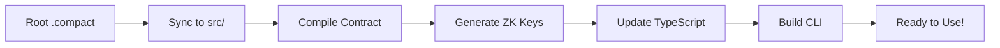

# 🌙 Midnight Compact Contract CLI Generator

[](https://midnight.network)
[](https://typescriptlang.org)
[](LICENSE)

**The fastest way to develop Midnight contracts.** Write your `.compact` contract and get a complete development environment with zero configuration. The system automatically generates a full-featured CLI, handles deployment, and manages your entire development workflow.

**No setup required. No manual updates. Just pure contract development.**

## 🚀 Quick Start

**Get started with Midnight development in under 2 minutes:**

```bash
git clone https://github.com/kaleababayneh/scaffold-midnight.git
cd scaffold-midnight
touch my-contract.compact
npm install
npm run deploy  # One command for complete deployment!
```

### 📝 **Write Your First Contract**

Edit your `.compact` file in the project root:
```compact
pragma language_version 0.15;

import CompactStandardLibrary;

export ledger counter: Counter;

export circuit increment(value: Uint<16>): [] {
  counter.increment(value);
}

export circuit get_count(): Uint<64> {
  return counter;
}
```

### 🎯 **Generate Everything Automatically**

```bash
npm run dev
```

This single command:
- 🔄 Syncs your contract to the build system
- 🔨 Compiles contract and generates ZK keys
- 📝 Creates TypeScript types and API functions  
- 🖥️ Builds a dynamic CLI that adapts to your contract
- ✅ Everything ready to use!

### 🚀 **Deploy & Test**

**For testnet deployment:**
```bash
npm run deploy
```

**For local development:**
```bash
npm run wallet
```

Interactive CLI will launch:
```
✅ Auto-detected contract: Counter (from counter.compact)
📊 Available functions: increment, get_count

You can do one of the following:
  1. Deploy a new Counter Contract
  2. Join an existing Counter Contract
  3. Exit
Which would you like to do?
```

## 🚀 Features

### ✨ **Zero-Configuration Development**
- **Auto-Detection**: Automatically finds and analyzes your `.compact` contracts
- **Dynamic CLI Generation**: Creates interactive CLI from your contract functions
- **Zero Manual Updates**: Change functions → regenerate → everything adapts automatically
- **Smart Contract Analysis**: Works with any contract structure and function names
- **Witness Function Support**: Automatically detects and includes private state functions

### 🌐 **Complete Deployment Pipeline**
- **One-Command Local Deployment**: `npm run deploy` for full local development setup
- **Docker Integration**: Automatically manages local Midnight node containers
- **Testnet Deployment**: Seamless testnet integration with `npm run wallet`
- **Prerequisite Validation**: Checks Docker, dependencies, and contract syntax
- **Dry Run Support**: Preview deployment with `--dry-run` flag

### 🔧 **Developer-Friendly Workflow**
- **Root-Level Editing**: Edit contracts directly in project root for easy access
- **Auto-Sync Pipeline**: Automatically syncs contracts to build directories
- **Clean Builds**: Removes old artifacts before rebuilding
- **Hot Reload**: Instant updates when contract changes
- **Comprehensive Compilation**: Handles ZK proof generation and TypeScript building

### 💰 **Wallet & Balance Management**  
- **Automatic Wallet Generation**: Creates secure wallets with one command
- **Balance Checking**: Real-time testnet balance monitoring
- **Faucet Integration**: Automated and manual token requesting
- **Transaction Management**: Full transaction lifecycle support

## 📁 Project Structure

```
example-counter/
├── my-contract.compact          # 📝 Edit your contract here (root level)
├── package.json                 # 📦 Main project configuration
├── .env                        # 🔐 Wallet configuration (auto-generated)
├── boilerplate/
│   ├── contract/               # 🔨 Contract compilation workspace
│   │   └── src/               # 📄 Auto-synced contracts & witnesses
│   │       ├── my-contract.compact    # ← Synced from root
│   │       ├── witnesses.ts           # 🔑 Private state functions
│   │       └── managed/               # 🏗️ Compiled output & ZK keys
│   ├── contract-cli/          # 🖥️ Generated CLI application
│   │   ├── src/              # 🎯 Dynamic CLI code
│   │   │   ├── api.ts        # 🔌 Contract interaction API
│   │   │   ├── cli.ts        # 🖥️ Interactive CLI interface
│   │   │   └── enhanced-api.ts # 📊 Contract metadata & analysis
│   │   └── standalone.yml    # 🐳 Docker configuration for local node
│   └── scripts/              # ⚙️ Build & deployment automation
│       ├── auto-generator.js # 🔄 Core auto-generation engine
│       ├── deploy.js         # 🚀 Deployment orchestrator
│       ├── check-balance.js  # 💰 Wallet balance checker
│       └── request-faucet.js # 🚰 Testnet token requests
└── README.md                   # 📖 This documentation
```

### 🔄 **How the Auto-Sync Works**

1. **📝 Edit**: Modify your `.compact` contract in the project root
2. **🔄 Sync**: `npm run dev` copies it to `boilerplate/contract/src/`
3. **🔨 Compile**: Contract compiles to `managed/` with ZK keys
4. **📝 Generate**: TypeScript types and API functions auto-generated
5. **🖥️ Build**: CLI updates with new contract functions
6. **✅ Ready**: Everything synchronized and ready to use

## 🔄 Development Workflow

### **1. Edit Contract (Root Level)**
```bash
# Edit your contract file in the project root  
nano my-contract.compact  # Use any editor you prefer
```

### **2. Auto-Generate Everything**
```bash
npm run dev
```

This command automatically:
- 🔄 Syncs your contract from root to build directory
- 🔨 Compiles contract with `compactc` and generates ZK keys  
- 📝 Updates TypeScript types and API functions
- 🖥️ Rebuilds CLI with new contract functions
- 🔍 Detects witness functions and includes them
- ✅ Everything synchronized and ready!

### **3. Deploy & Test**

**Local Development (Recommended):**
```bash
npm run deploy
```
- Starts local Midnight node in Docker
- Deploys your contract locally
- Launches interactive CLI for testing

**Testnet Deployment:**
```bash
npm run wallet
```
- Connects to live Midnight testnet
- Handles wallet creation and funding
- Deploys to public testnet

### **4. Iterate and Improve**
```bash
# Make changes to your contract
vim my-contract.compact

# Regenerate CLI (fast)
npm run dev

# Test changes
npm run deploy
```

## 💡 Development Tips

### **Best Practices**
- 🔄 **Always run `npm run dev`** after contract changes
- 📝 **Use descriptive function names** - they become CLI commands
- 🧪 **Test locally first** with `npm run deploy` before testnet
- 📊 **Check CLI output** for parameter hints and validation

### **Debugging**
- 🔍 **Contract not detected?** Ensure `.compact` file is in project root
- ⚠️ **Compilation errors?** Verify `pragma language_version` directive
- 🚫 **CLI generation failed?** Check `export circuit` function syntax
- 🌐 **Testnet issues?** Use `npm run balance` to verify wallet funds

## 🎛️ Available Commands

| Command | Description |
|---------|-------------|
| `npm run dev` | 🔄 Regenerate CLI from contract changes |
| `npm run deploy` | 🚀 Deploy to local Midnight node (full pipeline) |
| `npm run wallet` | 🌐 Deploy to testnet (interactive mode) |
| `npm run balance` | 💰 Check current wallet balance |
| `npm run generate-key` | 🔐 Generate new wallet seed and address |
| `npm run faucet` | 🚰 Request testnet tokens |
| `npm run build` | 🔨 Build all workspaces |
| `npm run test` | 🧪 Run test suite |

### 🚀 **Deployment Options**

```bash
# Full local deployment with Docker
npm run deploy

# Deploy new contract automatically (skip prompts)  
npm run deploy --new

# Join existing contract automatically
npm run deploy --join

# Preview commands without execution
npm run deploy --dry-run

# Interactive testnet deployment
npm run wallet

# Show deployment help
npm run deploy --help
```

### 🚀 **Automated Testnet Deployment**

The `npm run deploy` command provides a complete deployment workflow to Midnight testnet:

```bash
npm run deploy
```

This will:
1. 🔨 **Compile** your `.compact` contract and generate CLI
2. 🌐 **Connect** to Midnight testnet
3. 📦 **Deploy** your contract automatically  
4. 🎯 **Launch** interactive CLI for testing

**Requirements:**
- Node.js 18+
- `.compact` contract file in project root
- Wallet with testnet funds (or will be funded automatically)

**Deployment Modes:**
```bash
# Deploy a new contract automatically (default)
npm run deploy

# Join an existing contract automatically  
npm run deploy:join

# Interactive mode (prompts for choices)
npm run wallet

# Preview what commands will be executed
npm run deploy -- --dry-run
```


## 🏗️ How It Works

### **Auto-Detection System**
The system automatically:

1. **Scans** the root directory for `.compact` files
2. **Copies** them to the contract source directory (replacing old ones)
3. **Analyzes** contract functions and ledger state
4. **Generates** TypeScript types and API functions
5. **Builds** a dynamic CLI that adapts to your contract

### **Function Discovery**
```javascript
// Automatically detected from your contract:
export circuit increment(value: Uint<16>): [] { ... }
export circuit get_count(): Uint<64> { ... }

// Becomes CLI options:
// 1. Increment (1 param)
// 2. Get Count (read-only)
```

### **Smart CLI Generation**
- **Parameter Detection**: Automatically detects function parameters
- **Type Safety**: Generates TypeScript interfaces
- **Read-Only Functions**: Identifies and marks query functions
- **Interactive Menus**: Creates numbered options for all functions

## 🔧 Advanced Configuration

### **Custom Contract Names**
Just rename your `.compact` file - everything adapts automatically:
```bash
mv counter.compact voting.compact
npm run auto-generate  # CLI now shows "Voting Contract"
```

### **Multiple Functions**
Add any number of functions to your contract:
```compact
export circuit vote_for(candidate: Uint<8>): [] { ... }
export circuit get_votes(candidate: Uint<8>): Uint<64> { ... }
export circuit reset_votes(): [] { ... }
```

The CLI automatically generates options for all functions.

## 🌐 Testnet Deployment

### **Wallet Setup**
The CLI handles wallet creation automatically. For automated deployment, you can set your wallet seed in the environment:

**Option 1: Auto-generate wallet seed and address (Quickest)**
```bash
# Generate a new wallet seed and address automatically
npm run generate-key

# Request testnet tokens (provides manual instructions due to captcha requirement)
npm run request-faucet

# Deploy automatically without prompts  
npm run deploy
```

**Option 2: Manual environment setup**
```bash
# Copy the example file
cp .env.example .env

# Edit .env and add your seed phrase
WALLET_SEED=your-64-character-hex-seed-phrase-here

# Deploy automatically without prompts
npm run deploy
```

**Option 3: Interactive mode**
```
npm run wallet
# Will prompt: Enter your wallet seed: [generates new seed if empty]
Your wallet address is: mn_shield-addr_test1...
Your wallet balance is: 966962817
```

When `WALLET_SEED` is set in your environment, deployment will be fully automated without prompting for the seed phrase.

📋 **See [ENV_CONFIGURATION_GUIDE.md](./ENV_CONFIGURATION_GUIDE.md) for detailed environment variable setup.**

### **Checking Wallet Balance**

You can check your current wallet balance anytime using the dedicated balance command:

```bash
npm run balance
```

**Output example:**
```
🌙 Midnight Wallet Balance Checker

📍 Wallet Address: mn_shield-addr_test1ht0n6y...
🔗 Connecting to Midnight testnet...
⏳ Syncing wallet...

💰 Balance Information:
📍 Address: mn_shield-addr_test1ht0n6y...
💎 Balance: 1,000.000000 tUsdt  
🔢 Raw Balance: 1000000000 microTusdt

✅ Wallet has sufficient balance for contract operations!

🎯 Ready for development!
🚀 Deploy contracts with: npm run deploy
```

**Balance Status Messages:**
- 💡 **Zero balance**: Provides faucet instructions
- ⚠️ **Low balance**: Warns about insufficient funds for deployment
- ✅ **Sufficient balance**: Confirms readiness for development

**Usage:**
```bash
npm run balance              # Check balance
npm run balance -- --help   # Show help information
```

### **Requesting Testnet Tokens**

After generating your wallet, you'll need testnet tokens for deployment. Use the faucet request command:

```bash
npm run request-faucet
```

**How it works:**
1. 🔗 Connects to funded genesis wallet (3.2B+ tokens available)
2. 🔧 Creates proper transfer transaction using Midnight SDK
3. ⚡ Attempts automated token transfer to your wallet
4. 🛡️ Provides fallback instructions if proof server has version issues

**Expected outcomes:**
- ✅ **Success**: Tokens transferred automatically (when proof server compatible)
- ⚠️ **Version Mismatch**: Manual faucet instructions provided (common in testnet)
- 📍 **Always**: Your wallet address displayed for easy copy/paste

**Manual faucet (recommended fallback):**
- Visit: https://midnight.network/testnet-faucet
- Copy your wallet address from the command output  
- Complete the captcha verification
- Request 1000+ tokens (typically arrive within 1-2 minutes)

> **Note**: The automated faucet may encounter proof server version mismatches during testnet development. This is normal and will be resolved in future SDK updates. The manual faucet always works reliably.

### **Contract Deployment**
```
Deploy a new Counter Contract
✅ Deployed contract at address: 02000914e67a3e27f4...
🎉 Successfully deployed Counter Contract!
```

### **Function Calls**
Interactive function calling:
```
📊 Available functions: increment, get_count
1. Increment (1 param)
2. Get Count (read-only)

Which would you like to do? 1
Enter value (Uint<16>): 5
✅ Transaction successful!
```

## 🛠️ Architecture

### **Auto-Generator Pipeline**


### **CLI Components**
- **Contract Analyzer**: Parses contract functions and types
- **Dynamic Generator**: Creates CLI menus and handlers
- **API Layer**: Handles contract interactions
- **Wallet Integration**: Manages testnet connections

## 🎯 Example Use Cases

### **Voting Contract**
```compact
export circuit vote_for(candidate: Uint<8>): [] { ... }
export circuit get_results(): VoteResults { ... }
```

### **Token Contract**
```compact
export circuit transfer(to: Address, amount: Uint<64>): [] { ... }
export circuit get_balance(address: Address): Uint<64> { ... }
```

### **Gaming Contract**
```compact
export circuit make_move(player: Uint<8>, move: GameMove): [] { ... }
export circuit get_game_state(): GameState { ... }
```

**All generate fully functional CLIs automatically!** 🎉

## 🤝 Contributing

1. Fork the repository
2. Create your feature branch (`git checkout -b feature/amazing-feature`)
3. Commit your changes (`git commit -m 'Add amazing feature'`)
4. Push to the branch (`git push origin feature/amazing-feature`)
5. Open a Pull Request

## 📄 License

This project is licensed under the Apache License 2.0 - see the [LICENSE](LICENSE) file for details.

## 🙏 Acknowledgments

- [Midnight Network](https://midnight.network) for the Compact language and runtime
- The TypeScript and Node.js communities for excellent tooling

---

**Built with ❤️ for the Midnight ecosystem** 🌙

*Simplifying smart contract development, one auto-generation at a time.*


# 🚀 Deployment Flags Implementation Complete

This document summarizes the successful implementation of deployment mode flags for the Midnight scaffold project.

## ✅ Completed Features

### 🎯 Command Line Flag Support
- **`--new`**: Automatically deploy a new contract (default behavior)
- **`--join`**: Automatically join an existing contract
- **`--dry-run`**: Preview commands without execution
- **`--help`**: Show comprehensive help documentation

### 🔧 Implementation Details

#### 1. **Enhanced Deploy Script** (`boilerplate/scripts/deploy.js`)
- Added command line argument parsing for `--new`, `--join`, `--dry-run`, and `--help`
- Passes deployment mode via `DEPLOY_MODE` environment variable
- Maintains backwards compatibility (default behavior unchanged)

#### 2. **Updated CLI Logic** (`cli.ts` and `simple-enhanced-cli.ts`)
- Both CLI implementations now check `DEPLOY_MODE` environment variable
- Supports automatic deployment/joining when `AUTO_DEPLOY=true`
- Maintains interactive mode for manual usage

#### 3. **Documentation Updates** (`README.md`)
- Added section documenting new deployment flags
- Included examples of usage for each mode
- Updated command reference table

## 🎯 Usage Examples

```bash
# Deploy new contract automatically
npm run deploy --new

# Join existing contract automatically (prompts for address)
npm run deploy --join

# Preview what commands will run
npm run deploy --dry-run

# Show help
npm run deploy --help

# Default behavior (interactive mode)
npm run deploy
```

## 🔍 Testing Verification

### ✅ Verified Working
- [x] Command line argument parsing
- [x] Environment variable passing
- [x] CLI mode detection
- [x] Witness function detection still functional
- [x] Help system displays correctly
- [x] Dry-run mode works
- [x] Documentation updated

### 🔄 Behavior in Each Mode

#### `--new` Mode
1. Skips deployment choice prompt
2. Automatically deploys new contract
3. Proceeds to interactive CLI

#### `--join` Mode  
1. Skips deployment choice prompt
2. Prompts for contract address (as expected)
3. Joins existing contract
4. Proceeds to interactive CLI

#### Interactive Mode (default)
1. Shows deployment choice menu
2. User selects deploy/join/exit
3. Standard workflow continues

## 🛠️ Technical Implementation

### Environment Variables Used
- `AUTO_DEPLOY=true`: Enables automatic mode
- `DEPLOY_MODE=new|join`: Specifies deployment behavior

### File Changes
1. **`boilerplate/scripts/deploy.js`**: Added argument parsing and mode passing
2. **`boilerplate/contract-cli/src/cli.ts`**: Added mode detection logic  
3. **`boilerplate/contract-cli/src/simple-enhanced-cli.ts`**: Added mode detection logic
4. **`README.md`**: Added flag documentation

## 🎉 Impact

This implementation provides:
- **Automation Support**: Enables CI/CD and scripted deployments
- **Developer Experience**: Clear flags for different deployment scenarios  
- **Backwards Compatibility**: Existing workflows unchanged
- **Documentation**: Comprehensive usage examples

The deployment system now supports both automated and interactive workflows while maintaining the robust witness function detection and CLI generation capabilities of the original system.

---

**Status**: ✅ Complete and Ready for Use
**Next Steps**: The system is fully functional for production use with the new deployment flags.
