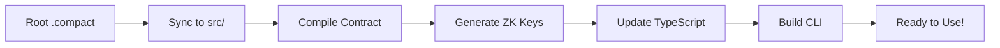

# 🌙 Midnight Smart Contract Scaffold

[](https://midnight.network)
[](https://typescriptlang.org)
[](https://nodejs.org)
[](LICENSE)

**The complete development scaffold for Midnight smart contracts.** Write your `.compact` contract and instantly get a full development environment with zero configuration. The system automatically generates a dynamic CLI, handles deployment pipelines, manages wallet operations, and provides a complete testing framework.

**🚀 From contract to production in minutes, not hours.**

## ✨ What You Get

- 🔄 **Auto-generating CLI** that adapts to your contract functions
- 🐳 **Docker-based local development** with full Midnight node
- 🌐 **Seamless testnet deployment** with automated wallet management
- 💰 **Built-in wallet tools** for balance checking and faucet requests
- 📊 **Smart contract analysis** with automatic type generation
- 🛠️ **Set ledger support** with enhanced state display
- 🔧 **Deployment automation** with CI/CD-ready flags
- 📝 **Comprehensive documentation** and debugging guides

## 📋 Table of Contents

- [Quick Start](#-quick-start)
- [Features](#-features)
- [Project Structure](#-project-structure)
- [Development Workflow](#-development-workflow)
- [Commands Reference](#-commands-reference)
- [Deployment Guide](#-deployment-guide)
- [Wallet Management](#-wallet-management)
- [Architecture](#️-architecture)
- [Troubleshooting](#-troubleshooting)
- [Advanced Configuration](#️-advanced-configuration)
- [Example Use Cases](#-example-use-cases)
- [FAQ](#-frequently-asked-questions)
- [Contributing](#-contributing)
- [License](#-license)
- [Additional Resources](#-additional-resources)

## 🚀 Quick Start

**Get started with Midnight development in under 2 minutes:**

```bash
# Clone the scaffold
git clone https://github.com/kaleababayneh/scaffold-midnight.git
cd scaffold-midnight

# Install dependencies
npm install

# Create your first contract
touch my-contract.compact

# Deploy and test (one command!)
npm run deploy
```

### 📋 Prerequisites

**System Requirements:**
- **Node.js 18+** - [Download](https://nodejs.org/)
- **Docker Desktop** - [Download](https://www.docker.com/products/docker-desktop/) (for local development)
- **Git** - [Download](https://git-scm.com/)

**Quick dependency check:**
```bash
node --version    # Should be 18+
docker --version  # Should be 20+
git --version     # Any recent version
```

### 📝 **Write Your First Contract**

Edit your `.compact` file in the project root:
```compact
pragma language_version 0.15;

import CompactStandardLibrary;

export ledger counter: Counter;

export circuit increment(value: Uint<16>): [] {
  counter.increment(value);
}

export circuit get_count(): Uint<64> {
  return counter;
}
```

### 🎯 **Generate Everything Automatically**

```bash
npm run dev
```

This single command:
- 🔄 Syncs your contract to the build system
- 🔨 Compiles contract and generates ZK keys
- 📝 Creates TypeScript types and API functions  
- 🖥️ Builds a dynamic CLI that adapts to your contract
- ✅ Everything ready to use!

### 🚀 **Deploy & Test**

**For testnet deployment:**
```bash
npm run deploy
```

**For local development:**
```bash
npm run wallet
```

Interactive CLI will launch:
```
✅ Auto-detected contract: Counter (from counter.compact)
📊 Available functions: increment, get_count

You can do one of the following:
  1. Deploy a new Counter Contract
  2. Join an existing Counter Contract
  3. Exit
Which would you like to do?
```

## 🚀 Features

### ✨ **Zero-Configuration Development**
- **Auto-Detection**: Automatically finds and analyzes your `.compact` contracts
- **Dynamic CLI Generation**: Creates interactive CLI from your contract functions
- **Zero Manual Updates**: Change functions → regenerate → everything adapts automatically
- **Smart Contract Analysis**: Works with any contract structure and function names
- **Witness Function Support**: Automatically detects and includes private state functions

### 🌐 **Complete Deployment Pipeline**
- **One-Command Local Deployment**: `npm run deploy` for full local development setup
- **Docker Integration**: Automatically manages local Midnight node containers
- **Testnet Deployment**: Seamless testnet integration with `npm run wallet`
- **Prerequisite Validation**: Checks Docker, dependencies, and contract syntax
- **Dry Run Support**: Preview deployment with `--dry-run` flag

### 🔧 **Developer-Friendly Workflow**
- **Root-Level Editing**: Edit contracts directly in project root for easy access
- **Auto-Sync Pipeline**: Automatically syncs contracts to build directories
- **Clean Builds**: Removes old artifacts before rebuilding
- **Hot Reload**: Instant updates when contract changes
- **Comprehensive Compilation**: Handles ZK proof generation and TypeScript building

### 💰 **Wallet & Balance Management**  
- **Automatic Wallet Generation**: Creates secure wallets with one command
- **Balance Checking**: Real-time testnet balance monitoring
- **Faucet Integration**: Automated and manual token requesting
- **Transaction Management**: Full transaction lifecycle support

## 📁 Project Structure

```
example-counter/
├── my-contract.compact          # 📝 Edit your contract here (root level)
├── package.json                 # 📦 Main project configuration
├── .env                        # 🔐 Wallet configuration (auto-generated)
├── boilerplate/
│   ├── contract/               # 🔨 Contract compilation workspace
│   │   └── src/               # 📄 Auto-synced contracts & witnesses
│   │       ├── my-contract.compact    # ← Synced from root
│   │       ├── witnesses.ts           # 🔑 Private state functions
│   │       └── managed/               # 🏗️ Compiled output & ZK keys
│   ├── contract-cli/          # 🖥️ Generated CLI application
│   │   ├── src/              # 🎯 Dynamic CLI code
│   │   │   ├── api.ts        # 🔌 Contract interaction API
│   │   │   ├── cli.ts        # 🖥️ Interactive CLI interface
│   │   │   └── enhanced-api.ts # 📊 Contract metadata & analysis
│   │   └── standalone.yml    # 🐳 Docker configuration for local node
│   └── scripts/              # ⚙️ Build & deployment automation
│       ├── auto-generator.js # 🔄 Core auto-generation engine
│       ├── deploy.js         # 🚀 Deployment orchestrator
│       ├── check-balance.js  # 💰 Wallet balance checker
│       └── request-faucet.js # 🚰 Testnet token requests
└── README.md                   # 📖 This documentation
```

### 🔄 **How the Auto-Sync Works**

1. **📝 Edit**: Modify your `.compact` contract in the project root
2. **🔄 Sync**: `npm run dev` copies it to `boilerplate/contract/src/`
3. **🔨 Compile**: Contract compiles to `managed/` with ZK keys
4. **📝 Generate**: TypeScript types and API functions auto-generated
5. **🖥️ Build**: CLI updates with new contract functions
6. **✅ Ready**: Everything synchronized and ready to use

## 🔄 Development Workflow

### **1. Edit Contract (Root Level)**
```bash
# Edit your contract file in the project root  
nano my-contract.compact  # Use any editor you prefer
```

### **2. Auto-Generate Everything**
```bash
npm run dev
```

This command automatically:
- 🔄 Syncs your contract from root to build directory
- 🔨 Compiles contract with `compactc` and generates ZK keys  
- 📝 Updates TypeScript types and API functions
- 🖥️ Rebuilds CLI with new contract functions
- 🔍 Detects witness functions and includes them
- ✅ Everything synchronized and ready!

### **3. Deploy & Test**

**Local Development (Recommended):**
```bash
npm run deploy
```
- Starts local Midnight node in Docker
- Deploys your contract locally
- Launches interactive CLI for testing

**Testnet Deployment:**
```bash
npm run wallet
```
- Connects to live Midnight testnet
- Handles wallet creation and funding
- Deploys to public testnet

### **4. Iterate and Improve**
```bash
# Make changes to your contract
vim my-contract.compact

# Regenerate CLI (fast)
npm run dev

# Test changes
npm run deploy
```

## 🔧 Troubleshooting

### 🚨 Common Issues & Solutions

| Issue | Symptoms | Solution |
|-------|----------|----------|
| **Contract not detected** | "No .compact files found" | Ensure `.compact` file is in project root |
| **Compilation errors** | Build fails, ZK key generation errors | Check `pragma language_version` directive |
| **CLI generation failed** | Missing menu options | Verify `export circuit` function syntax |
| **Docker issues** | Local deployment fails | Ensure Docker Desktop is running |
| **Testnet connection** | Wallet sync timeouts | Check internet connection, try `npm run balance` |
| **Zero balance** | Deployment fails with "insufficient funds" | Run `npm run faucet` or use manual faucet |
| **Permission errors** | File system access denied | Run `sudo npm run deploy` or fix file permissions |

### 🔍 Debug Commands

```bash
# Check system requirements
node --version && docker --version && git --version

# Verify contract syntax
npm run build

# Check wallet status
npm run balance

# View detailed logs
npm run deploy --dry-run

# Test local environment
docker ps
```

### 📞 Getting Help

1. **Check the logs** in `boilerplate/contract-cli/logs/`
2. **Search issues** on [GitHub](https://github.com/kaleababayneh/scaffold-midnight/issues)
3. **Join Midnight Discord** for community support
4. **Create an issue** with error logs and system info

## 🎛️ Commands Reference

| Command | Purpose | Environment |
|---------|---------|-------------|
| `npm run dev` | 🔄 Regenerate CLI from contract changes | Local |
| `npm run deploy` | 🚀 Deploy to local Midnight node (Docker) | Local |
| `npm run wallet` | 🌐 Deploy to testnet (interactive) | Testnet |
| `npm run balance` | 💰 Check current wallet balance | Testnet |
| `npm run generate-key` | 🔐 Generate new wallet seed and address | Testnet |
| `npm run faucet` | 🚰 Request testnet tokens | Testnet |
| `npm run build` | 🔨 Build all workspaces | Local |
| `npm run test` | 🧪 Run test suite | Local |

## 🚀 Deployment Guide

### 🐳 Local Development (Recommended for Testing)

**Quick local deployment:**
```bash
npm run deploy
```

This command:
1. 🔨 Compiles your contract and generates CLI
2. 🐳 Starts local Midnight node in Docker
3. 📦 Deploys contract to local network
4. 🎯 Launches interactive CLI for testing

**Local deployment features:**
- ⚡ **Fast iteration** - No network delays
- 🔧 **Full control** - Complete local blockchain
- 🧪 **Safe testing** - No real tokens required
- 📊 **Detailed logs** - Full debugging information

### 🌐 Testnet Deployment

**Interactive testnet deployment:**
```bash
npm run wallet
```

**Automated testnet deployment:**
```bash
# Deploy new contract automatically
npm run deploy --new

# Join existing contract
npm run deploy --join

# Preview commands (dry run)
npm run deploy --dry-run
```

### 🔧 Deployment Flags

| Flag | Behavior | Use Case |
|------|----------|----------|
| `--new` | Auto-deploy new contract | CI/CD pipelines |
| `--join` | Auto-join existing contract | Team collaboration |
| `--dry-run` | Preview commands only | Testing scripts |
| `--help` | Show detailed help | Documentation |

**Examples:**
```bash
# CI/CD deployment
npm run deploy --new

# Team member joining project
npm run deploy --join

# Script testing
npm run deploy --dry-run
```


## 🏗️ How It Works

### **Auto-Detection System**
The system automatically:

1. **Scans** the root directory for `.compact` files
2. **Copies** them to the contract source directory (replacing old ones)
3. **Analyzes** contract functions and ledger state
4. **Generates** TypeScript types and API functions
5. **Builds** a dynamic CLI that adapts to your contract

### **Function Discovery**
```javascript
// Automatically detected from your contract:
export circuit increment(value: Uint<16>): [] { ... }
export circuit get_count(): Uint<64> { ... }

// Becomes CLI options:
// 1. Increment (1 param)
// 2. Get Count (read-only)
```

### **Smart CLI Generation**
- **Parameter Detection**: Automatically detects function parameters
- **Type Safety**: Generates TypeScript interfaces
- **Read-Only Functions**: Identifies and marks query functions
- **Interactive Menus**: Creates numbered options for all functions

## ⚙️ Advanced Configuration

### 🎨 Custom Contract Examples

**Counter Contract:**
```compact
pragma language_version 0.15;
import CompactStandardLibrary;

export ledger counter: Counter;

export circuit increment(value: Uint<16>): [] {
  counter.increment(value);
}

export circuit get_count(): Uint<64> {
  return counter;
}
```

**Voting Contract:**
```compact
pragma language_version 0.15;
import CompactStandardLibrary;

export ledger votes: VotingState;

export circuit vote_for(candidate: Uint<8>): [] {
  votes.vote(candidate);
}

export circuit get_results(): VotingResults {
  return votes.getResults();
}
```

**Token Contract:**
```compact
pragma language_version 0.15;
import CompactStandardLibrary;

export ledger tokens: TokenLedger;

export circuit transfer(to: Address, amount: Uint<64>): [] {
  tokens.transfer(to, amount);
}

export circuit get_balance(address: Address): Uint<64> {
  return tokens.balanceOf(address);
}
```

### 🔧 Environment Variables

Create a `.env` file for configuration:

```bash
# Wallet Configuration
WALLET_SEED=your-64-character-hex-seed-phrase
WALLET_ADDRESS=your-wallet-address

# Network Configuration  
MIDNIGHT_NETWORK=testnet
INDEXER_URL=https://indexer.testnet-02.midnight.network/api/v1/graphql
NODE_URL=https://rpc.testnet-02.midnight.network

# Development Settings
AUTO_DEPLOY=false
DEPLOY_MODE=new
QUICK_TEST=false

# Cache Settings
SYNC_CACHE=./cache
LOG_LEVEL=info
```

### 🎯 Set Ledger Support

The scaffold now supports **Set ledger variables** with enhanced display:

```compact
export ledger items: Set<Bytes<32>>;
```

**In contract state display:**
```
=== Contract State ===
Contract Address: 02000914e67a3e27f4...
items (Set<data>): [
  "0x1234567890abcdef...",
  "0xfedcba0987654321..."
]
```

**If Set contents aren't directly enumerable:**
```
items (Set<data>): [Set contents not directly enumerable]
ℹ️  To display Set contents, ensure your contract exposes a read-only function to enumerate or query the Set.
```

### 🔄 Multiple Contract Support

The system detects and uses the first `.compact` file found. For multiple contracts:

```bash
# Rename active contract
mv voting.compact active-contract.compact
mv counter.compact backup-counter.compact

# Regenerate CLI
npm run dev
```

## 💰 Wallet Management

### 🔐 Wallet Creation

**Option 1: Auto-generate wallet (Recommended)**
```bash
npm run generate-key
```

**Option 2: Manual setup**
```bash
# Copy example configuration
cp .env.example .env

# Edit .env file and add your seed
WALLET_SEED=your-64-character-hex-seed-phrase-here
```

**Option 3: Interactive creation**
```bash
npm run wallet
# Will prompt for seed or generate new one
```

### 💰 Balance Checking

**Check wallet balance:**
```bash
npm run balance
```

**Output example:**
```
🌙 Midnight Wallet Balance Checker

📍 Wallet Address: mn_shield-addr_test1ht0n6y...
🔗 Connecting to Midnight testnet...
⏳ Syncing wallet...

💰 Balance Information:
📍 Address: mn_shield-addr_test1ht0n6y...
💎 Balance: 1,000.000000 tUsdt  
🔢 Raw Balance: 1000000000 microTusdt

✅ Wallet has sufficient balance for contract operations!
```

**Balance status indicators:**
- 💡 **Zero balance**: Shows faucet instructions
- ⚠️ **Low balance**: Warns about insufficient funds
- ✅ **Sufficient balance**: Ready for development

### 🚰 Getting Testnet Tokens

**Automated faucet request:**
```bash
npm run faucet
```

**Manual faucet (recommended fallback):**
1. Visit: https://midnight.network/testnet-faucet
2. Copy your wallet address from CLI output
3. Complete captcha verification
4. Request 1000+ tokens (usually arrives in 1-2 minutes)

> **Note**: Automated faucet may encounter proof server version mismatches during testnet development. Manual faucet is always reliable.

## 🛠️ Architecture

### **Auto-Generator Pipeline**


### **CLI Components**
- **Contract Analyzer**: Parses contract functions and types
- **Dynamic Generator**: Creates CLI menus and handlers
- **API Layer**: Handles contract interactions
- **Wallet Integration**: Manages testnet connections

## 🎯 Example Use Cases

### 🗳️ Decentralized Voting System
```compact
pragma language_version 0.15;
import CompactStandardLibrary;

export ledger votes: VotingState;
export ledger voters: Set<Address>;

export circuit vote_for(candidate: Uint<8>): [] {
  assert(!voters.has(msg.sender), "Already voted");
  voters.add(msg.sender);
  votes.incrementVotes(candidate);
}

export circuit get_results(): VotingResults {
  return votes.getResults();
}
```

**Generated CLI features:**
- Vote for candidates (with duplicate prevention)
- View real-time results
- Check voting eligibility

### 💰 Token Management System
```compact
pragma language_version 0.15;
import CompactStandardLibrary;

export ledger balances: Map<Address, Uint<64>>;
export ledger totalSupply: Uint<64>;

export circuit transfer(to: Address, amount: Uint<64>): [] {
  balances[msg.sender] -= amount;
  balances[to] += amount;
}

export circuit get_balance(address: Address): Uint<64> {
  return balances[address];
}
```

**Generated CLI features:**
- Transfer tokens between addresses
- Check account balances
- View total supply

### 🎮 Gaming State Management
```compact
pragma language_version 0.15;
import CompactStandardLibrary;

export ledger gameState: GameBoard;
export ledger players: Map<Address, PlayerStats>;

export circuit make_move(x: Uint<8>, y: Uint<8>, piece: GamePiece): [] {
  gameState.placePiece(x, y, piece);
  players[msg.sender].incrementMoves();
}

export circuit get_game_state(): GameBoard {
  return gameState;
}
```

**Generated CLI features:**
- Make game moves with coordinate input
- View current game board
- Check player statistics

**🎉 All examples generate fully functional CLIs automatically!**

## 🤝 Contributing

We welcome contributions! Here's how to get started:

### 🚀 Quick Contribution Setup

```bash
# Fork and clone the repository
git clone https://github.com/yourusername/scaffold-midnight.git
cd scaffold-midnight

# Install dependencies
npm install

# Create a feature branch
git checkout -b feature/amazing-feature

# Make your changes and test
npm run test
npm run build

# Commit and push
git commit -m 'Add amazing feature'
git push origin feature/amazing-feature
```

### 📋 Contribution Guidelines

**Before contributing:**
- [ ] Read the [Code of Conduct](CODE_OF_CONDUCT.md)
- [ ] Check existing [issues](https://github.com/kaleababayneh/scaffold-midnight/issues)
- [ ] Test your changes locally
- [ ] Update documentation if needed

**Types of contributions welcome:**
- 🐛 **Bug fixes** - Fix issues with the scaffold
- ✨ **New features** - Add functionality to improve developer experience
- 📚 **Documentation** - Improve guides, examples, and API docs
- 🎨 **UI/UX** - Enhance CLI interface and user experience
- 🧪 **Tests** - Add test coverage and improve reliability

### 🔧 Development Workflow

```bash
# Run tests
npm run test

# Test with a sample contract
echo 'export circuit test(): [] {}' > test.compact
npm run dev

# Check code quality
npm run lint

# Build all packages
npm run build
```

### 📝 Pull Request Process

1. **Update documentation** for any new features
2. **Add tests** for bug fixes or new functionality  
3. **Follow coding standards** (ESLint/Prettier)
4. **Write clear commit messages** following [Conventional Commits](https://conventionalcommits.org/)
5. **Update CHANGELOG.md** if applicable

## 📄 License

This project is licensed under the **Apache License 2.0** - see the [LICENSE](LICENSE) file for full details.

### 📋 License Summary

- ✅ **Commercial use** - Use in commercial projects
- ✅ **Modification** - Modify and distribute changes
- ✅ **Distribution** - Distribute original or modified versions
- ✅ **Patent use** - Express grant of patent rights
- ⚠️ **Trademark use** - Does not grant trademark rights
- ⚠️ **Liability** - Disclaimer of liability
- ⚠️ **Warranty** - No warranty provided

### 🔗 Related Licenses

- **Midnight Network**: Check [Midnight's licensing terms](https://midnight.network/legal)
- **Dependencies**: See individual package licenses in `node_modules`

## 🙏 Acknowledgments

### 🌟 Special Thanks

- **[Midnight Network](https://midnight.network)** - For the Compact language, runtime, and toolchain
- **[TypeScript Team](https://typescriptlang.org)** - For excellent type system and tooling
- **[Node.js Community](https://nodejs.org)** - For the runtime and ecosystem
- **[Docker Inc.](https://docker.com)** - For containerization technology

### 🏗️ Built With

- **[Compact Language](https://midnight.network)** - Smart contract language
- **[TypeScript](https://typescriptlang.org)** - Type-safe JavaScript
- **[Node.js](https://nodejs.org)** - JavaScript runtime
- **[Docker](https://docker.com)** - Containerization
- **[ESLint](https://eslint.org)** - Code linting
- **[Prettier](https://prettier.io)** - Code formatting
- **[Vitest](https://vitest.dev)** - Testing framework

### 🤝 Community

- **Discord**: [Join Midnight Community](https://discord.gg/midnight)
- **Twitter**: [@MidnightNtwrk](https://twitter.com/MidnightNtwrk)
- **GitHub**: [Midnight Network](https://github.com/midnight-ntwrk)
- **Documentation**: [Midnight Docs](https://docs.midnight.network)

## 📚 Additional Resources

### 📖 Learning Materials

- **[Compact Language Guide](https://docs.midnight.network/compact)** - Official language documentation
- **[Midnight Developer Docs](https://docs.midnight.network)** - Complete developer resources
- **[Smart Contract Examples](https://github.com/midnight-ntwrk/examples)** - Example contracts and patterns
- **[Best Practices](https://docs.midnight.network/best-practices)** - Security and optimization guides

### 🛠️ Tools & Extensions

- **[VS Code Extension](https://marketplace.visualstudio.com/items?itemName=midnight.compact)** - Syntax highlighting for Compact
- **[Midnight CLI](https://github.com/midnight-ntwrk/cli)** - Official command line tools
- **[Network Explorer](https://explorer.midnight.network)** - Blockchain explorer
- **[Testnet Faucet](https://midnight.network/testnet-faucet)** - Get test tokens

### 🔧 API References

- **[Compact Runtime API](https://docs.midnight.network/api/runtime)** - Runtime functions and types
- **[Wallet API](https://docs.midnight.network/api/wallet)** - Wallet integration
- **[Network API](https://docs.midnight.network/api/network)** - Network interactions
- **[Indexer API](https://docs.midnight.network/api/indexer)** - Query blockchain data

## ❓ Frequently Asked Questions

### 🚀 Getting Started

**Q: What is the minimum Node.js version required?**
A: Node.js 18 or higher is required. Check with `node --version`.

**Q: Do I need Docker for development?**
A: Docker is required for local development (`npm run deploy`). For testnet only, Docker is optional.

**Q: Can I use this with existing Midnight contracts?**
A: Yes! Just place your `.compact` file in the project root and run `npm run dev`.

### 🔧 Development Issues

**Q: My contract changes aren't reflected in the CLI**
A: Always run `npm run dev` after modifying your `.compact` file to regenerate the CLI.

**Q: I get "Contract not detected" errors**
A: Ensure your `.compact` file is in the project root (not in subdirectories) and has the correct file extension.

**Q: The CLI shows "Function not found" errors**
A: Verify your function syntax uses `export circuit functionName(params): ReturnType { ... }` format.

**Q: Local deployment fails with Docker errors**
A: Ensure Docker Desktop is running and you have sufficient system resources (4GB+ RAM recommended).

### 💰 Wallet & Tokens

**Q: How do I get testnet tokens?**
A: Use `npm run faucet` for automated requests, or visit https://midnight.network/testnet-faucet for manual requests.

**Q: My wallet shows zero balance but I requested tokens**
A: Tokens can take 1-2 minutes to arrive. Use `npm run balance` to check status. Ensure you're using the correct wallet address.

**Q: Can I use my existing Midnight wallet?**
A: Yes! Add your `WALLET_SEED` to the `.env` file to use an existing wallet.

**Q: Is it safe to store my wallet seed in `.env`?**
A: Only for development/testnet. Never commit `.env` files with real wallet seeds to version control.

### 🌐 Network & Deployment

**Q: What's the difference between local and testnet deployment?**
A: Local deployment (`npm run deploy`) uses Docker for fast testing. Testnet deployment (`npm run wallet`) uses the live Midnight testnet.

**Q: Can I deploy to mainnet?**
A: This scaffold is designed for development and testnet. For mainnet deployment, use official Midnight tools with proper security practices.

**Q: How do I join someone else's contract?**
A: Use `npm run deploy --join` and provide the contract address when prompted.

**Q: My testnet deployment is slow**
A: Testnet performance varies. For faster iteration, use local deployment (`npm run deploy`) during development.

### 🛠️ Advanced Usage

**Q: Can I customize the generated CLI?**
A: Yes! Modify files in `boilerplate/contract-cli/src/` to customize CLI behavior. The system will preserve your changes.

**Q: How do I add custom witness functions?**
A: Edit `boilerplate/contract/src/witnesses.ts` to add your private state logic.

**Q: Can I use multiple contracts in one project?**
A: Currently, the system uses the first `.compact` file found. For multiple contracts, rename files or use separate project directories.

**Q: How do I integrate this with CI/CD?**
A: Use deployment flags like `npm run deploy --new --dry-run` in your CI scripts. Ensure Docker is available in your CI environment.

### 🔍 Debugging

**Q: Where are the log files located?**
A: Check `boilerplate/contract-cli/logs/` for detailed execution logs.

**Q: How do I enable debug mode?**
A: Set `LOG_LEVEL=debug` in your `.env` file for verbose logging.

**Q: My Set ledger variables don't display properly**
A: The system attempts to display Set contents automatically. If it shows "not enumerable", add a read-only function to query Set contents.

**Q: I get TypeScript compilation errors**
A: Run `npm run build` to check for syntax errors in your contract or witness functions.

---

**Built with ❤️ for the Midnight ecosystem** 🌙

*Empowering developers to build privacy-preserving applications with zero-knowledge proofs.*

---

## 📊 Project Status

| Feature | Status | Notes |
|---------|--------|-------|
| ✅ Auto-CLI Generation | Complete | Supports all contract types |
| ✅ Local Development | Complete | Docker-based Midnight node |
| ✅ Testnet Deployment | Complete | Automated wallet management |
| ✅ Set Ledger Support | Complete | Enhanced state display |
| ✅ Deployment Flags | Complete | CI/CD ready |
| ✅ Wallet Tools | Complete | Balance checking, faucet |
| ✅ Documentation | Complete | Comprehensive guides |
| 🔄 Multi-Contract Support | Planned | Support multiple contracts |
| 🔄 GUI Interface | Planned | Web-based contract interaction |
| 🔄 Contract Templates | Planned | Pre-built contract examples |

**Last Updated**: June 13, 2025  
**Version**: 2.0.0  
**Stability**: Production Ready 🚀
